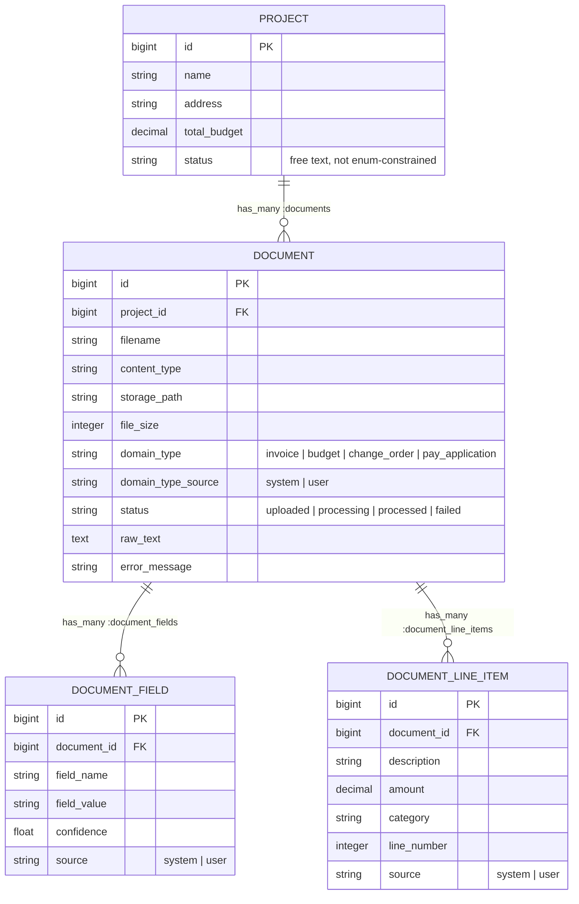

# Document Pipeline

Document Pipeline is a Phoenix LiveView application for managing construction
loan projects and the documents (invoices, budgets, change orders, pay
applications) submitted against them. Uploaded documents are classified and
have structured fields/line items extracted from them via a pluggable AI
pipeline (Claude by default), processed asynchronously with Oban, and
reviewed/corrected live in the UI over `Phoenix.PubSub` — no separate API
layer, everything is server-rendered LiveView.

## Prerequisites

* Elixir `~> 1.15` and a compatible Erlang/OTP
* PostgreSQL running locally (defaults to `localhost`, see
  `config/dev.exs` / `config/test.exs`)
* Node is not required — assets are built with `esbuild`/`tailwind`, which
  `mix setup` installs automatically

## Setup

```bash
# Install dependencies, create/migrate the dev database, and build assets
mix setup
```

### Environment variables

Dev and test both default to the **mock** classifier/extractor adapters
(`config/dev.exs`, `config/test.exs`), so the full upload → classify →
extract → correct loop works locally with **no API key required** — that's
the intended way to run and demo this app day to day.

To exercise the real Anthropic-backed adapters instead:

```elixir
# config/dev.exs
config :document_pipeline,
  classifier_adapter: DocumentPipeline.AI.Classifier.DefaultAdapter,
  extractor_adapter: DocumentPipeline.AI.Extractor.DefaultAdapter
```

```bash
export ANTHROPIC_API_KEY=sk-ant-...
```

`config/runtime.exs` reads this into `:document_pipeline, :anthropic_api_key`
at boot (dev and prod alike), which is what the default adapters call
`Application.get_env(:document_pipeline, :anthropic_api_key)` to fetch.

Production additionally requires `DATABASE_URL` and `SECRET_KEY_BASE` — see
`config/runtime.exs` for the full list and defaults.

## Running the server

```bash
iex -S mix phx.server
```

Then visit:

* [`localhost:4000/workspace`](http://localhost:4000/workspace) — the main
  screen: upload a document, watch it classify/extract live, correct its
  type, hand-edit fields
* [`localhost:4000/projects`](http://localhost:4000/projects),
  `/documents`, `/document_fields`, `/document_line_items` — plain CRUD
  screens (`mix phx.gen.live` scaffolding) for poking at the underlying data
  directly; not linked from the main nav
* [`localhost:4000/dev/dashboard`](http://localhost:4000/dev/dashboard) —
  Phoenix LiveDashboard (dev only)

If the server fails to start with `:eaddrinuse`, port 4000 is already held
by another process (commonly a previous `phx.server` run that didn't shut
down cleanly) — find and stop it with `lsof -nP -iTCP:4000 -sTCP:LISTEN`.

## Running tests

```bash
mix test
```

The `test` alias creates/migrates the test database automatically before
running (`config/test.exs` uses the `document_pipeline_test` database,
partitioned per `MIX_TEST_PARTITION` for parallel test runs). Oban runs with
`testing: :manual` in test, so jobs enqueue but don't execute automatically —
tests drive `ProcessDocumentWorker` explicitly via `Oban.Testing`.

## Before committing

```bash
mix precommit
```

Runs `compile --warnings-as-errors`, `deps.unlock --unused`, `format`, and
`test` — fix any issues this surfaces before opening a PR.

## Architecture overview

* **`DocumentPipeline.Projects`** / **`DocumentPipeline.Documents`** — the
  core contexts. Projects own documents; documents own extracted fields and
  line items.
* **`DocumentPipeline.AI.Classifier`** / **`DocumentPipeline.AI.Extractor`** —
  behaviours with pluggable adapters (a real Claude-backed adapter and a
  mock adapter with deterministic fixture data), selected via
  `:document_pipeline, :classifier_adapter` / `:extractor_adapter`.
* **`DocumentPipeline.Workers.ProcessDocumentWorker`** — an Oban worker that
  runs an uploaded document through text extraction, classification, and
  field/line-item extraction, updating its `status` throughout and
  broadcasting completion over `Phoenix.PubSub` on the `"document#{id}"`
  topic.
* **`DocumentPipelineWeb.WorkspaceLive`** — the primary UI. Subscribes to
  each visible document's PubSub topic so extraction results and status
  changes appear without a page refresh; also drives type correction and
  inline field editing.

## Data model



**Walkthrough:**

1. A **Project** is created (e.g. `"Montana - Phase 3"`) and owns any number
   of **Documents** uploaded against it (`Project.has_many :documents` /
   `Document.belongs_to :project`, FK `document.project_id`).
2. Uploading a document (`Documents.upload_document/4`) writes the file to
   `priv/uploads/<uuid>_<filename>`, inserts a `Document` row with
   `status: "uploaded"`, and enqueues `ProcessDocumentWorker` via Oban.
3. The worker walks the document through `status` values in order —
   `uploaded → processing → processed` on success, or `failed` (with
   `error_message` set to the failure reason) if any step errors.
4. Once classified, the extractor produces the document's **DocumentFields**
   (key/value pairs like `vendor_name`, `invoice_number`) and
   **DocumentLineItems** (cost-breakdown rows) using a schema specific to
   the domain type — `change_order` never has line items, the other three
   types do.
5. Both `DocumentField` and `DocumentLineItem` carry a `source` column
   (`"system"` vs `"user"`): AI-extracted fields start as `"system"` with a
   `confidence` score; hand-correcting one via `update_field/2` flips it to
   `"user"` with `confidence: 1.0`. Correcting a document's type via
   `correct_document_type/2` deletes all of its fields/line items and
   re-triggers extraction against the corrected type, stamping
   `domain_type_source: "user"`.

## Known gaps

* **FK deletes aren't cascading.** `documents.project_id`,
  `document_fields.document_id`, and `document_line_items.document_id` are
  all declared with `on_delete: :nothing`. `delete_project/1` and
  `delete_document/1` call `Repo.delete/1` directly with no cleanup, so
  deleting a project/document that still has children raises a raw
  Postgres foreign-key violation instead of cascading or erroring cleanly.
* **`get_documents_needing_review/1` is still unused and untested.** It
  used to always return `[]` (`d.status == [...]` compared a string to a
  list instead of using `in`) — fixed, but nothing calls it yet.
* **`"requires_review"`** is rendered as a status badge in
  `WorkspaceLive.status_badge/1` and referenced in `Documents` docstrings,
  but no code path actually sets it on a document yet — it's aspirational.
* The type-correction flow (`correct_type` event /
  `Documents.correct_document_type/2`) has no regression test yet, despite
  being the most state-heavy interaction in the app (wipe + reprocess +
  live update).
